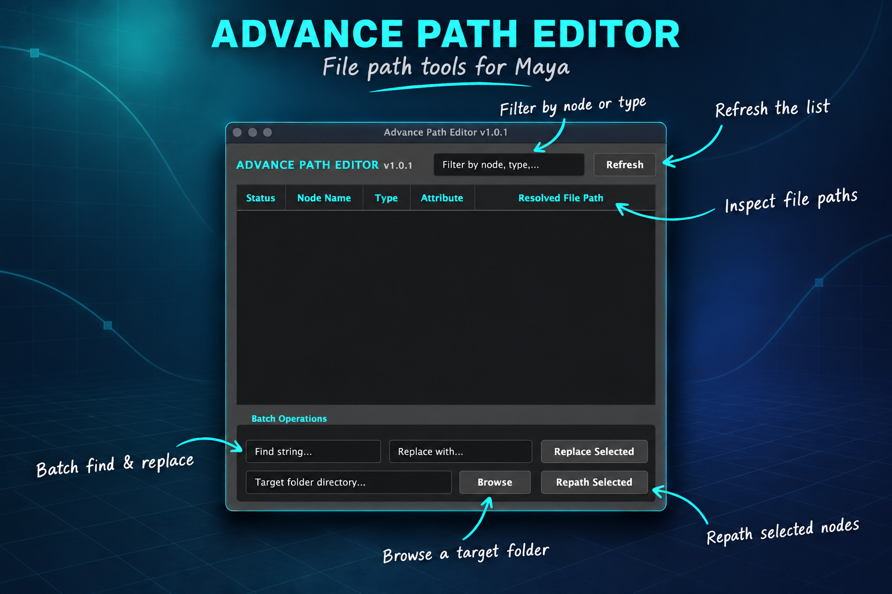

# Advance Path Editor V1.0.1



A modern, high-performance Qt asset path editor and validator for **Autodesk Maya** and **Chaos V-Ray**.

Advance Path Editor V1.0.1 replaces Maya's legacy File Path Editor with instant node filtering, live missing asset detection, bulk network mount replacement, and folder repathing.

---

## What's New in V1.0.1

- **Cross-Version Maya Support**: Auto-detects and binds to `PySide2` (Maya 2018–2024) or `PySide6` (Maya 2025–2026+).
- **V-Ray Suite Integration**: Native discovery for `VRayPlaceEnvTex`, `VRayMesh` (Proxies), `VRayVolumeGrid` (OpenVDB), `VRayLightIESShape`, `VRayVRmat`, `VRayPtex`, and `VRayOSL`.
- **Core Pipeline Nodes**: Tracks standard Maya `file` textures, Arnold `aiImage`, and Alembic caches (`AlembicNode`).
- **Dark Minimalist Interface**: Neon cyan accent styling, high-contrast status tags, and row-level selections.

---

## Quick Launch

### Shelf Button
Add this script to a custom Maya shelf button (set interpreter to **Python**):

```python
import advance_path_editor
advance_path_editor.show_ui()
```

### Script Editor
Open `advance_path_editor.py` in the **Python** tab of Maya's Script Editor and execute with `Ctrl + Enter`.

---

## Node & Attribute Matrix

| Type | Target Attribute | Description |
| :--- | :--- | :--- |
| `file` | `fileTextureName` | Maya standard textures |
| `aiImage` | `filename` | Arnold image nodes |
| `AlembicNode` | `abc_File` | Alembic point/geo caches |
| `VRayPlaceEnvTex` | `fileName` | HDRI dome & environment maps |
| `VRayMesh` | `filePath` | V-Ray proxy geometry (.vrmesh) |
| `VRayVolumeGrid` | `fileName` | V-Ray / PhoenixFD OpenVDB caches |
| `VRayLightIESShape` | `iesFile` | Photometric IES light profiles |
| `VRayVRmat` / `VRayOSL` | `filename` / `oslFilePath` | Material presets & OSL shaders |

---

## Author
**Rahul Vilas Gambhir**  
GitHub: [@thecodemaster21](https://github.com/thecodemaster21)

## License
Released under the [MIT License](LICENSE).